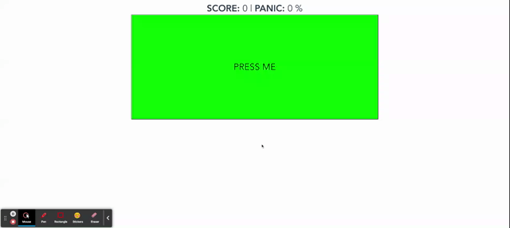

# cucjestcypress

This is a simple vue.js app where you can score points by clicking the button on the screen. However, if you click the button too many times very quickly, the button will become disabled and you will have to wait until the cooldown timer runs out to begin pressing again.



Also included in this app are a suite of Jest unit tests and Cypress end to end tests, the latter pictured below.


## Project setup
```
npm install
```

### Compiles and hot-reloads for development
```
npm run serve
```

### Compiles and minifies for production
```
npm run build
```

### Run your unit tests
```
npm run test:unit
```

### Run your end-to-end tests
```
npm run test:e2e
```

### Lints and fixes files
```
npm run lint
```

### Customize configuration
See [Configuration Reference](https://cli.vuejs.org/config/).
